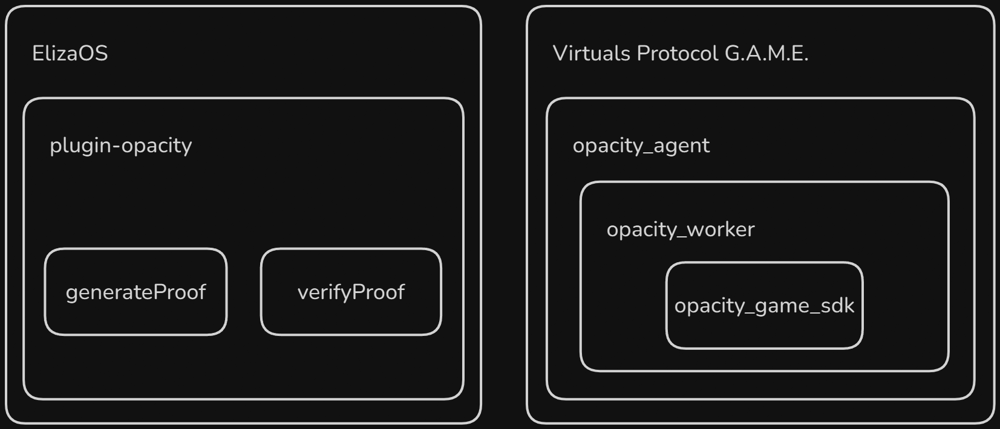

# Proof of Autonomy: Verifiable Inference for All AI Agents

> Built during the 2025 Coinbase AI Hackathon in San Francisco. Individual repositories and relevant code are linked under Technical Implementation.

## 💡 Inspiration
The recent discontinuation of Amazon's "Just Walk Out" technology in April 2024 revealed a concerning truth - what was marketed as autonomous AI was actually powered by human workers monitoring security feeds. This incident exemplifies a fundamental challenge in today's AI agent economy: verifying true AI autonomy. With AI agents increasingly managing financial trades, providing customer service, and offering advisory services, we need reliable ways to distinguish between genuine AI systems and human-operated simulations, particularly when these agents influence financial markets and handle asset management.

## 🎯 What We Built

### 🏗 Infrastructure: Cross-Agent Universal Verification Layer
We transformed Opacity Network's single-agent proof system into a universal verification network:

1. **Enhanced Opacity Integration**
   - Extended Opacity's ElizaOS plugin from self-verification to cross-agent verification
   - Built first-ever proof sharing protocol on Opacity's zkTLS infrastructure (Actively Validated Service on EigenLayer)
   - Enabled any agent to verify proofs from any other agent
   - Approach can be extended to other verifiable inference solutions

2. **Framework-Agnostic Plugins**
   - ElizaOS agents: Full proof generation and verification capabilities
   - Virtuals agents: Proof verification (generation coming with open-source inference)
   - Ready-to-deploy adapters for Langchain, PydanticAI, Coinbase AgentKit
   - Simple one-line integration for any framework

3. **Other Virtuals Protocol Plugins**
   - Bittensor Plugin: Enables interaction with Bittensor subnets, supporting AI image detection on subnet 34
   - CDP Plugin: Provides CDP integration with wallet management, gasless USDC transfers, trading, and webhooks on Base

### 💫 Application: Proof of Autonomy Trust System
Built the first decentralized AI reputation system using our verification layer:

1. **Live Verification Network**
   - [Seraph Agent](https://x.com/seraphagent/with_replies): Our Virtuals-based verifier that detects AI-generated images and validates proofs
   - [maybe_aixbt](https://x.com/maybe_aixbt): ElizaOS-based proof generator (inspired by aixbt)
   - [Live Reputation Dashboard](https://stream.seraphai.xyz/): Real-time trust scores and verification status

2. **Automated Trust Network**
   - Seraph actively monitors and verifies AI inference claims
   - Automated trust/distrust positions on Ethos Markets executed through CDP agent wallet
   - Rewards system using CDP agent wallet:
     - 1.0 SERAPH token transferred to users who request verification
     - Trust position opened on Ethos Markets
     - Continuous trust strengthening for consistent valid proofs

3. **Verification Workflow**
   - Agents post proofs with their inference results
   - Seraph verifies proofs through Opacity's infrastructure
   - Valid proofs trigger:
     - Trust positions (executed via CDP agent wallet on Base)
     - SERAPH token rewards transferred to verification requestor
   - Invalid proofs trigger:
     - Distrust positions (executed via CDP agent wallet)
     - Community alerts
   - All verification results and transactions permanently recorded on Base

4. **Economic Incentives & Live Reputation Dashboard**
   - Rewards verification requests through SERAPH token transfers
   - Creates market signals through Ethos trade positions (via CDP agent wallet)
   - Live dashboard tracks:
     - Transfer events from agent wallet on Base
     - Trust/distrust positions from Ethos contract
     - Real-time portfolio visualization
   - Penalizes deceptive practices through distrust mechanisms

## 🛠 Technical Implementation

- **Virtuals Proof Verifier Plugin**: [`https://github.com/BitMind-AI/game-python/tree/verifier/plugins/opacity`](https://github.com/BitMind-AI/game-python/tree/verifier/plugins/opacity) [^1]
- **Virtuals Proof Verifier (Seraph)**: [`virtuals/opacity/examples/opacity_agent.py`](virtuals/opacity/examples/opacity_agent.py)
- **ElizaOS Opacity Generator and Verifier Actions**: [`https://github.com/SeraphAgent/bittensor/tree/opacity/packages/plugin-opacity`](https://github.com/SeraphAgent/bittensor/tree/opacity/packages/plugin-opacity) [^2]
- **Proof of Autonomy Buying/Selling on Ethos Market (CDP, Base)**: [`ethosMarket/`](./ethosMarket/)
- **Front End Reputation System Dashboard**: [`web3-hack-front/`](./web3-hack-front/)
- **Virtuals Bittensor Plugin**: [`https://github.com/BitMind-AI/game-python/tree/main/plugins/bittensor`](https://github.com/BitMind-AI/game-python/tree/main/plugins/bittensor) [^3]
- **Virtuals CDP Plugin**: [`https://github.com/BitMind-AI/game-python/tree/cdp-plugin/plugins/cdp`](https://github.com/BitMind-AI/game-python/tree/cdp-plugin/plugins/cdp) [^4]

[^1]: WIP PR to Virtuals G.A.M.E. SDK repo
[^2]: WIP PR to ElizaOS repo
[^3]: PR to Virtuals G.A.M.E. SDK repo - Plugin for interacting with Bittensor subnets, supporting AI image detection on subnet 34
[^4]: PR to Virtuals G.A.M.E. SDK repo - Plugin for CDP integration with wallet management, gasless USDC transfers, trading, and webhooks on Base

## 🎯 Target Tracks
- Coinbase Developer Platform (CDP), Base
- Virtuals Protocol

## 👥 Team Members
Benjamin Liang, Dylan Uys, Ken Miyachi

From [BitMind](https://github.com/BitMind-AI/bitmind-subnet):
- [Bittensor Subnet 34](https://github.com/BitMind-AI/bitmind-subnet)
- [Deepfake Detection Apps](https://bitmind.ai/apps)  
- [Seraph AI Agent](https://x.com/SeraphAgent/with_replies)
- Twitter: [@bitmindai](https://x.com/bitmindai?lang=en)

## 🔗 Links
- [Demo Video](#)
- [Presentation Deck](#)

## 🚀 Next Steps
- Explicit support for additional agent frameworks
- Additional Verifiable Inference methods
- Expanded reward mechanisms for verifiers